# 🛡️ ShieldFlow — Context-Aware Developer Security & Autonomous Release Governance Platform

> **Transforming Security from a CI/CD Bottleneck into an In-IDE Superpower.**  
> ShieldFlow filters alert noise, models end-to-end exploitability in runtime context, generates verified fixes, and automates policy-driven release gates.

---

## 📌 Executive Summary & Problem Statement

Modern DevSecOps workflows are plagued by **alert fatigue, high false-positive rates, and late-stage friction**:

- **🚨 95%+ Alert Fatigue**: Raw SAST, SCA, and Secret Scanners generate hundreds of low-context alerts (e.g., test fixtures, internal scripts, unreachable code). Developers drown in noise and ignore critical warnings.
- **⚡ Severity ≠ True Risk**: A "Critical" CVSS vulnerability in an offline test suite or behind an authenticated internal microservice is treated with the same urgency as an unauthenticated, internet-facing SQL injection on production payment tables.
- **⏱️ Slow & Risky Remediation**: Security fixes are proposed without automated regression verification, leading to broken builds, broken APIs, and prolonged release delays.
- **🚪 Last-Mile CI/CD Blockers**: Developers only discover security policy failures at the PR/merge stage, causing context switching and emergency patch cycles.

### 💡 The ShieldFlow Solution

**ShieldFlow** bridges the gap between Security teams and Software Engineers by shifting context-aware risk intelligence directly into the developer's IDE, automating root-cause verification, and orchestrating intelligent CI/CD release decisions.

```
┌─────────────────┐       ┌────────────────────────┐       ┌────────────────────────┐       ┌───────────────────────┐
│  Raw Scanners   │       │   Context Risk Engine  │       │  IDE Security Copilot  │       │ CI/CD Release Decision│
│ (127 Findings)  │ ───►  │  (3 Release-Relevant)  │ ───►  │ (Auto-Fix & In-Editor) │ ───►  │ (BLOCK 92 ➔ ALLOW 8) │
└─────────────────┘       └────────────────────────┘       └────────────────────────┘       └───────────────────────┘
```

---

## 🏗️ System Architecture

ShieldFlow is built on a modular, decoupled architecture consisting of five core subsystems:

```mermaid
flowchart TB
    subgraph DataIngestion["1. Telemetry & Scanner Ingestion"]
        SAST["SAST Engine\n(AST & Taint Flow)"]
        SCA["SCA Scanner\n(Dependencies & CVEs)"]
        Secrets["Secret Scanner\n(Vault & Config)"]
        RuntimeContext["Infra & Runtime Metadata\n(Exposure, Auth, DB)"]
    end

    subgraph CoreEngine["2. Context Risk & Graph Analysis"]
        RiskEngine["Context-Aware Risk Scorer\n(0 - 100 Dynamic Risk)"]
        GraphModeler["Attack Path Graph Modeler\n(Source ➔ Sink Reachability)"]
        NoiseFilter["Intelligent Noise Deprioritizer\n(127 ➔ 3 Findings)"]
    end

    subgraph DeveloperExperience["3. Shift-Left IDE Integration"]
        IDEPlugin["VS Code Security Assistant\n(In-Situ Code Diagnostics)"]
        RemediationEngine["Safe Patch Generator\n(Parameterized AST Rewriter)"]
        QuickFix["1-Click Quick Fix Engine"]
    end

    subgraph VerificationSubsystem["4. Automated Verification Engine"]
        TaintCheck["AST Untainting Analysis"]
        ReachabilityScan["Reachability Re-Scan"]
        UnitTests["Pytest / Unit Regression Suite"]
        PolicyGate["Security Policy Validator"]
    end

    subgraph ReleaseGovernance["5. CI/CD & Security Intelligence"]
        CICDDecision["Dynamic Release Gate\n(BLOCK / REVIEW / ALLOW)"]
        AuditTelemetry["Security Overview Dashboard\n(KPIs, Attack Surface, MTTR)"]
    end

    DataIngestion --> CoreEngine
    CoreEngine --> DeveloperExperience
    DeveloperExperience --> VerificationSubsystem
    VerificationSubsystem --> ReleaseGovernance
```



---

## 🔬 Core Components & Capabilities

### 1. 🛡️ Developer Security Assistant (IDE Experience)
- **Real-Time In-Situ Diagnostics**: Directly visualizes security flaws (e.g. SQL Injection in `users.py:42`) with actionable line-level squiggles and diagnostics.
- **Explainable Risk Metadata**: Displays the calculated context risk (e.g., `92 / 100`), decision confidence (`94%`), and release blocker status inside the developer's editing view.
- **One-Click Remediation**: Proposes side-by-side diffs that replace vulnerable dynamic SQL concatenation with parameterized SQL query bindings.

### 2. 🌐 Context & Attack Path Risk Analysis
- **Full Attack Path Modeling**: Visually traces the end-to-end exploit vector:
  $$\text{Internet (Public IP)} \longrightarrow \text{API Gateway} \longrightarrow \text{User Input (user\_id)} \longrightarrow \text{Vulnerable Query} \longrightarrow \text{Production PostgreSQL}$$
- **Context Scoring Matrix**:
  - **Internet Exposure**: High (Public API route `/users`)
  - **User Reachability**: High (Unsanitized query parameters)
  - **Production Environment**: High (`payments-api` in `Production`)
  - **Asset Criticality**: High (Customer PII & Account records)
- **Why Only 3 of 127 Findings?**: Explainability modal classifying 124 deprioritized alerts (68 unreachable paths, 32 test-only files, 18 devDependencies, 6 WAF-mitigated).

### 3. 🧪 Automated Verification Engine
Before any code is committed, ShieldFlow runs an instant 4-step automated verification:
1. **Static Security Analysis (SAST)**: AST tree inspection confirms parameter untainting.
2. **Vulnerability Reachability Scan**: Verifies user input parameterization stops injection.
3. **Syntactic & Unit Test Suite**: Executes test suites to prevent regression or broken contracts.
4. **Security Policy Regression Gate**: Re-evaluates risk score from **92 (BLOCK)** down to **8 (ALLOW)**.

### 4. 🚀 CI/CD Release Decision Gate
- **Pipeline Synchronization**: Evaluates PR compliance against organizational release criteria.
- **Dynamic Decision Status**:
  - `BLOCKED` (Risk $\ge 70$ or unresolved release blockers)
  - `REVIEW` ($40 \le \text{Risk} < 70$, requiring manual security sign-off)
  - `ALLOWED` ($\text{Risk} < 40$, all blockers resolved and verified)
- **Audit Trail & Commit Push**: Automates signed commits with tamper-proof security verification metadata.

### 5. 📊 Security Overview Dashboard
- **Executive & Operational Telemetry**: Total raw scanner findings vs. release-relevant findings vs. blocked pipelines.
- **Risk Score Breakdown**: Visual radar and bar metrics detailing vulnerability distribution across SAST, SCA, Secret Scanner, and Container images.
- **Real-Time Attack Surface Reduction**: Tracks risk reduction metrics before and after ShieldFlow remediation.

---

## 🖥️ Prototype Walkthrough Guide

The prototype application provides a live interactive demonstration with 5 sequential states:

| Step | View / Module | Route | What to Explore |
| :--- | :--- | :--- | :--- |
| **1** | **IDE Security Assistant** | `/ide` | View the VS Code mockup with vulnerable Python Flask code (`users.py:42`), the security diagnostic banner, and click **"Review Fix & Verify"**. |
| **2** | **Context & Risk Analysis** | `/context` | Inspect the interactive **Attack Path Graph**, context factors (Exposure, Reachability, Asset Criticality), and open **"Why only 3 of 127?"**. |
| **3** | **Remediation & Verification** | `/remediation` | Review the side-by-side diff view, apply the remediation patch, watch the **Automated Verification Engine** run live tests, and click **"Commit Changes & Review CI/CD"**. |
| **4** | **CI/CD Release Decision** | `/cicd` | Observe the pipeline transition from `BLOCKED` to `ALLOWED`, review the git commit log, and inspect release compliance status. |
| **5** | **Security Overview Dashboard** | `/dashboard` | Examine portfolio-level vulnerability distribution, noise reduction KPIs, and active repositories. |

---

## 🛠️ Technology Stack

- **Frontend Framework**: [React 19](https://react.dev/) + [TypeScript](https://www.typescriptlang.org/)
- **Build Tool & Bundler**: [Vite](https://vitejs.dev/)
- **Styling & Design System**: [Tailwind CSS v4](https://tailwindcss.com/)
- **UI Components & Icons**: [Lucide React](https://lucide.dev/)
- **Animations & Micro-interactions**: [Framer Motion](https://www.framer.com/motion/)
- **State Management**: React Context API with persistent demo scenario orchestrator
- **Code Linter**: [Oxlint](https://oxc.rs/)

---

## 🚀 Quick Start & Installation

### Prerequisites
- [Node.js](https://nodejs.org/) (version `18.x` or later)
- `npm` or `pnpm` or `yarn`

### Setup Instructions

1. **Clone the repository:**
   ```bash
   git clone https://github.com/Harsh2059/HackRony.git
   cd HackRony
   ```

2. **Install dependencies:**
   ```bash
   npm install
   ```

3. **Start the local development server:**
   ```bash
   npm run dev
   ```

4. **Access the application:**
   Open your browser and navigate to:
   ```text
   http://localhost:5173/
   ```

---

## 📁 Repository Structure

```text
HackRony/
├── index.html                   # HTML entry point
├── package.json                 # Dependencies and build scripts
├── postcss.config.js            # PostCSS configuration
├── tailwind.config.js           # Tailwind design tokens and themes
├── tsconfig.json                # TypeScript compiler configuration
├── vite.config.ts               # Vite configuration
└── src/
    ├── App.tsx                  # Main layout orchestrator & modal manager
    ├── main.tsx                 # React DOM entry point
    ├── index.css                # Global design system styles & themes
    ├── types/
    │   └── index.ts             # Domain models (Finding, RiskDecision, AttackPathNode)
    ├── context/
    │   └── DemoContext.tsx      # Global state & interactive scenario state machine
    ├── data/
    │   └── mock/
    │       └── findings.ts      # Comprehensive mock security findings & context factors
    ├── services/
    │   ├── findingService.ts    # Finding querying and filtering service
    │   ├── releaseService.ts    # CI/CD release policy evaluation service
    │   ├── remediationService.ts# Auto-remediation code patch logic
    │   ├── riskService.ts       # Contextual risk score calculations
    │   └── verificationService.ts# Multi-stage automated verification engine
    ├── components/
    │   ├── layout/
    │   │   ├── DemoControlsBar.tsx # Step tracker & reset control bar
    │   │   ├── Header.tsx          # Top navigation, status indicator & theme switcher
    │   │   └── Sidebar.tsx         # Module navigation sidebar
    │   └── modals/
    │       ├── CommitModal.tsx     # Git commit confirmation modal
    │       ├── ContextVsSeverityModal.tsx # CVSS vs. ShieldFlow Risk explanation
    │       ├── SettingsModal.tsx   # Policy threshold settings modal
    │       └── WhyOnly3Modal.tsx   # Noise reduction & filter explainability modal
    └── pages/
        ├── IDESecurityPage.tsx     # VS Code IDE assistant simulation
        ├── ContextRiskPage.tsx     # Attack graph and context risk matrix
        ├── RemediationVerifPage.tsx# Diff view & automated verification checks
        ├── CICDPage.tsx            # CI/CD pipeline release blocker gate
        ├── DashboardPage.tsx       # Security overview metrics & KPIs
        └── FindingsPage.tsx        # Comprehensive finding list & inspector
```

---

## 🎯 Key Differentiators

| Feature | Legacy Security Scanners | ShieldFlow |
| :--- | :--- | :--- |
| **Alert Volume** | 100+ raw alerts per repository | **3 release-critical findings** (97.6% noise reduction) |
| **Risk Scoring** | Static CVSS (Isolated file scan) | **Context-Aware Score** (Public exposure + Reachability + Criticality) |
| **Developer Location** | External Web Dashboard / PDF report | **Native In-IDE Assistant** (Direct line diagnostics & quick-fixes) |
| **Fix Validation** | Manual re-scan and trial-and-error | **Automated Multi-Tier Verification** (AST + Unit Tests + Policy) |
| **CI/CD Integration** | Rigid blockers causing pipeline delays | **Dynamic Release Decision Gate** (Self-healing with verified commits) |

---

## 👥 Authors & Team
Built with ❤️ for the Hackathon by the **HackRony Team**.
